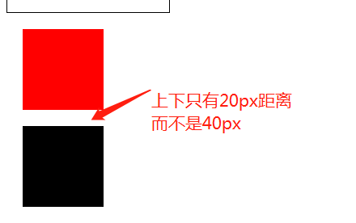
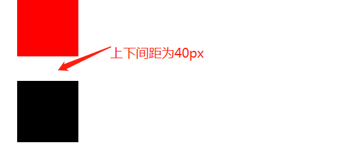

### BFC和IFC

#### 前提

处于__普通流（Normal Flow）__中的盒子都会属于一个格式化上下文（Formatting context），要么是__块级格式化上下文（Block formatting context，BFC）__，要么是__行内格式化上下文（Inline formatting context，IFC）__，但不会两者都是。__块级盒子参与的是BFC，行内盒子参与的是IFC__。

#### `position schemes`：定位策略

定位策略是影响盒子布局的因素之一。

一个盒子可以根据三种定位策略来渲染自身：

* `normal flow`：普通流。在css2中，普通流包括处于BFC中的块级盒子、处于IFC中的行内盒子，还有相对定位的块级和行内盒子。
* `floats`：在浮动模式下，盒子首先会按照普通流来渲染，然后跳出普通流并尽可能的左右移动。
* `absolute position`：在绝对定位模式下，盒子会完全跳出普通流，它的位置会相对于有`position`属性的包含容器来定位，此时，绝对定位的盒子对后面兄弟盒子的布局没有影响。

如果元素有浮动属性或者绝对定位属性，或者是一个根元素，那么我们就说这个元素是脱离普通流的（out of flow），而剩下的都叫处于普通流中（in-flow）

#### 通过`position`属性来选择定位策略

`position`属性有5个值：`static`、`relative`、`absolute`、`fixed`、`inherit`

* `static`、`relative`：这两种情况下盒子都处于普通流中。`static`为`position`属性的默认值，此时元素的`top`、`left`、`bottom`、`right`不会起作用。`position:relative`的盒子，它的位置会相对于自身处于正常模式下的位置根据`top`、`left`、`bottom`、`right`属性进行移动，并且，当A为`relative`的盒子时，其临近的盒子在渲染时会认为A并没有偏移。
* `absolute`、`fixed`：`absolute`的元素的`top`、`left`、`bottom`、`right`属性是相对于含有`position`属性的祖先元素的，也就是说`absolute`元素渲染出的盒子的位置不仅和`top/left/bottom/right`有关，还和最近的含有`position`属性的祖先元素的位置有关。`fixed`可以说是`absolute`的子类，两者都会是使盒子脱离普通流。`fixed`元素的定位和`absolute`差不多，只不过`fixed`的盒子参照的不再是含有`position`属性的祖先元素，而是一些固定的参照，比如视口（viewport），此时，盒子不会因为鼠标的滚动而滚动。`absolute`定位下的盒子不会发生外边距合并。

#### BFC和IFC

##### BFC: Block Formatting Context

什么情况下会产生新的BFC：

* float不为none
* position不为static、relative
* display为inline-block、table-cell、table-caption
* overflow不为visible

在__以上条件下的容器都会为自己的内容创建一个新的BFC__。

在BFC中，盒子都是从容器的顶部开始，从上至下一个接一个的垂直排列。两个盒子之间的垂直距离由margin属性来决定。在同一个BFC中，相邻的块级盒子之间的margin会发生折叠。

BFC更多的布局规则如下：

* 每个元素的左边，与容器的左边相接触，即使浮动也是如此（如果是右布局的话则靠近右边缘）；
* 创建了BFC的元素不会与float元素重叠；
* BFC就是页面上的一个隔离的独立容器，容器里面的子元素不会影响到外面的元素，反之也是如此；
* 计算BFC的高度时，浮动元素也参与其中。

###### BFC应用

比如，我们想实现一个简单的两栏布局，如下图所示：


通常我们都是这么实现的

```html
<style>
	.black{
      	width:200px;
      	height:200px;
      	float:left;
		background:black;
	}
	.red{
      	width:200px;
      	height:300px;
      	margin-left:200px;
		background:red;
	}
</style>
<div class="black"></div>
<div class="red"></div>
```

这样确实也能实现如图的效果，但这种实现利用了左浮动的盒子的宽度和`margin-left`。如何使代码适用于更普遍的情况？答案就是使用`overflow:hidden`为右边的盒子重新创建一个BFC。

```html
<style>
	.black{
      	width:200px;
      	height:200px;
      	float:left;
		background:black;
	}
	.red{
      	width:200px;
      	height:300px;
      	overflow:hidden;
		background:red;
	}
</style>
<div class="black"></div>
<div class="red"></div>
```

上面的代码渲染出来的效果和上图一致，而且不需要知道左边盒子的宽度。利用到的就是BFC的布局规则之一：BFC的区域不会与float重叠。

BFC还可以用来解决外边距合并问题。

```html
<style>
	.top{
      	width:100px;
      	height:100px;
      	background:red;
      	margin:20px;
	}
	.bottom{
      	width:100px;
      	height:100px;
      	background:black;
      	margin:20px;
	}
</style>
<div class="top"></div>
<div class="bottom"></div>
```

上面代码显示的效果如下：



可以看到，上下两个盒子之间的边距只有20px，而不是想象中的40px，这就是因为发生了外边距合并（外边距合并只发生在垂直方向，水平方向不会有外边距合并），解决方法是使两个div 处于不同的BFC中，为其中一个元素添加具有BFC的包裹容器。修改代码如下：

```html
<style>
	.top{
      	width:100px;
      	height:100px;
      	background:red;
      	margin:20px;
	}
	.bottom{
      	width:100px;
      	height:100px;
      	background:black;
      	margin:20px;
	}
	.box{
      	overflow:hidden;
	}
</style>
<div class="top"></div>
<div class="box">
	<div class="bottom"></div>
</div>
```

显示效果如下：



BFC清除浮动。

```
<style>
	.parent{
      	width: 500px;
      	border:1ps solid black;
	}
	.black{
		margin-top:10px;
      	width:200px;
      	height:300px;
      	float:left;
		background:black;
	}
	.red{
		margin-top:10px;
      	width:200px;
      	height:300px;
      	float:left;
		background:red;
	}
</style>
<div>
	<div class="balck"></div>
	<div class="red"></div>
</div>
```

由于子元素为浮动元素，处在另一个BFC中，所以父元素也就无法被撑开（BFC之间相互不影响），解决方法就是为父元素加上`overflow:hidden`(计算BFC的高度时，浮动元素也参与其中)。显示效果如下：


##### IFC: Inline Formatting Context

IFC由不包含块级盒子的容器创建。

在IFC中，盒子都是从包含容器头部开始，水平的一个接一个的排列的。水平方向的margin、border、padding控制着两盒子之间的距离。
处于同一行的盒子构成一个矩形区域，叫line box。

line box的宽度由浮动情况和它的容器决定。line box高度的计算规则可以看[这里](https://www.w3.org/TR/CSS22/visudet.html#line-height)

对于所包含的所有盒子来说，line box总是足够高的，也许它比包含在内部的最高的盒子还要高。对于盒子B来讲，如果B比包含它的line box高度低，那么B在line box中的垂直对齐方式可以通过vertical align属性控制。如果几个行内级盒子在一个单独的line box中不能完全放置下，它们就会被分配成2个或更多的垂直相邻的line boxes。因此，可以说，一个段落是多个line boxes的垂直排布构成的。除非特意添加间距，否则在垂直方向上，line boxes之间是没有距离的。

通常，line box的左边缘紧挨着它的容器的左边缘，右边缘紧挨着它的包含快的右边缘。然而浮动盒子也许会出现在容器边缘和line box边缘之间。因此，处于同一个行内格式上下文的line boxes通常都有相同的宽度（就是它的容器的宽度），但如果有浮动元素出现的话，它们的宽度会变得复杂，因为浮动元素会占据一定的容器宽度。line boxes在同样的行内格式上下文中，通常在高度上是多样的，（比如一行也许包含了一个最高的图片，而其他的可能只含有文字）。

当在一行中的行内级盒子的总宽度比包含他们的line box的宽度小，则他们在line box的水平位置由`text-align`属性决定。如果属性值是`justify`，则文字内容为两端对齐，大概下面这样的效果：


代码如下：

```html
<style>
        
    .text span{
        width: 100px;
        text-align: justify;
        display: inline-block;
        vertical-align: top;
    }
    .text span:after{
        content:'';
        display: inline-block;
        width: 100%;
        height: 0;
    }
    input{
        width: 100px;
    }
        
  </style>
<div class="text" >

    <span>电话</span>：<input/><br/>
    <span>手机</span>：<input/><br/>
    <span>电子邮箱</span>：<input/><br/>
</div>
```

多说一点：

`text-align:justify`不处理块内的最后一行文本，所以上面的代码中，给每个span之后又加了一个伪元素，使span内的文字不是最后一行。

参考：

http://blog.sina.com.cn/s/blog_877284510101jo5d.html

