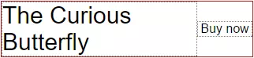
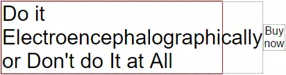
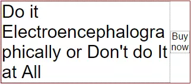

#### flex item的尺寸

flex item有一个默认的min-width、min-height属性，其值为auto。这两个值适用于设置项目在主轴上的尺寸，如果不是主轴上的尺寸，那么会被认为是设置为0。

正常情况下，如果项目没有明确的设置width、height属性，则min-width/min-height设置为auto代表项目的尺寸即为项目内容的大小；如果项目设置了明确的width、height值，则min-width/min-height:auto表示的值会比内容尺寸和设置的尺寸要小。看个例子：

页面上个区域左边显示书名，右边显示对应的购买（Buy Now）按钮，如下图：



书名和购买按钮是左右布局。

首先，因为书名有长有短，所以书名所在的flex item肯定不能设置固定的width值；其次，上面这块区域可能宽度也不是确定的，所以为了充分利用空间，也没法给书名所在的flex item设置max-width值。其实我们想要的结果就是书名和按钮能充满这个区域，同时又不会溢出。

先看下下面的实现，效果就是上面的图：

```html
<style>
	.book{
        display: flex;
        width: 300px;
	}
	.desc{
        font-size: 30px;
	}
	.buy{
        margin-left: auto;
        width: 80px;
        text-align: center;
        align-self: center;
	}
</style>
<div class='book'>
	<div class='desc'>The Curious Butterfly</div>
	<div class='buy'>Buy Now</div>
</div>
```

看起来是很不错的，因为’Butterfly‘前面有个空格，正好可以换行。如果书名中有个单词很长的话，看效果



书名中较长的那个单词会把书名所在区域撑宽，Buy Now按钮也会被挤到一边，如果红框为手机屏幕的话，同时外层又设置了overflow:hidden，那么这个Buy Now按钮就一直都看不到了。

导致书名区域被撑宽的原因就是flex item自带的min-width:auto属性，因为书名区域没有固定宽度，所以书名区域的宽度就被解析为内容宽度，恰好书名中有个单词比较长，就把书名区域撑宽了。

解决方法是设置书名所在flex item的min-width属性值为0，这样书名区域的宽度就不会和内容宽度一致。另外，在处理下单词的换行：

```html
<style>
	.book{
        display: flex;
        width: 300px;
	}
	.desc{
        font-size: 30px;
        min-width: 0;
        word-wrap: break-word;
	}
	.buy{
        margin-left: auto;
        width: 80px;
        text-align: center;
        align-self: center;
	}
</style>
<div class='book'>
	<div class='desc'>The Curious Butterfly</div>
	<div class='buy'>Buy Now</div>
</div>
```

结果就是下面这个样子：

