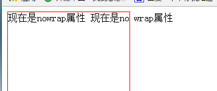
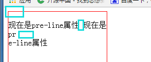

## `white-space`

`white-space`这个属性用来设置如何处理元素内的空白

```
white-space:normal|pre|nowrap|pre-wrap|pre-line|inherit
```

> `normal`：默认值，空白会被浏览器所忽略，多个空格会被浏览器压缩成一个。

`pre`是`preserve`（保留）的缩写，它跟保留空格有关

`pre`：保留所有的空格，且不允许折行

`nowrap`：文本不会换行，文本会在同一行上继续，直到遇到`<br>`标签为止

`pre-wrap`：保留空白符序列，但是正常的进行换行

`pre-line`：合并空白符序列，但是保留换行符，并且正常的进行换行。

`inherit`：从父元素继承`white-space`属性的值

> 看下面代码

```
<style>
	div{width: 200px; height: 200px; border: 1px solid red;white-space: pre}
  </style>
  <div>
  现在是pre属性     现在是pr
  e属性
  </div>
```

`white-space`属性值为`pre`则元素div中的所有空格换行样式都会保留，上面代码显示效果如下：


上图中蓝色框框分别对应是换行、空格、空格、换行、空格。

看看相同代码，`white-space`设成`nowrap`是什么效果：`white-space:nowrap`



可以看到，换行消失了，多个空格也被压缩成了一个空格。继续，`white-space:pre-wrap`


可以看到，与`white-space:pre`相比，这里在一行显示不下的时候，自动进行了换行。

接下来，`white-space:pre-line`：

可以看到，多个空格被压缩成了一个，但是回车换行依然还保留着，而且这个时候可以正常的进行换行。

总结一下： `pre`会使元素中空格回车原样显示，并且不会自动换行；

​		   `nowrap`：多个空格压缩成一个，回车换行消失，并且不会自动换行，直到`<br>`为止；

​		    `pre-wrap`：原样显示元素中空格和回车，并且显示不下时自动换行；

​		     `pre-line`：压缩空格，但是保留回车，并且显示不下时自动换行。

一个`white-space`的应用，文本溢出的部分用`...`显示：

```
<style>
	div{width: 200px; 
	height: 200px; 
	border: 1px solid red;
	white-space: nowrap; 
	text-overflow:ellipsis;
	overflow: hidden;}
  </style>
  <div>
  现在是pre属性     现在是pr
  e属性
  </div>
```

显示效果如下：

主要用到的css样式是`white-space:nowrap;text-overflow:ellipsis;overflow:hidden`