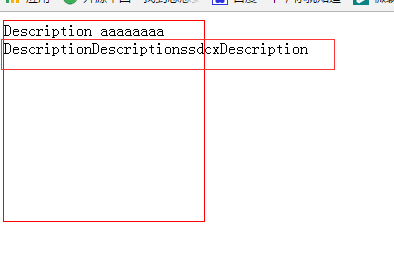
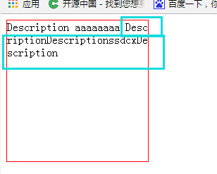
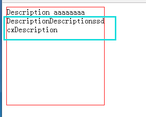
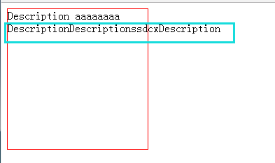

今天说下css中的断词，主要用到下面两个属性`word-break`和`word-wrap`.


看上面这张图，`word-break`和`word-wrap`解决的就是此类问题

好了，先来说一下基本概念：

​	`word-break`：默认值`normal`，属性值可继承

​	`normal`：使用浏览器默认的换行规则，长单词放不下是放到下一行，如果还放不下，则溢出

​	`break-all`：允许在单词内换行

​	`keep-all`：只能在半角空格或连字符处换行

````
<style>
	div{width: 200px;height: 200px;border: 1px solid red;word-break: keep-all}
 </style>
 <div>
 	Description aaaaaaaa  DescriptionDescriptionssdcxDescription
 </div>
````

以上代码在浏览器中解析玩是是这样的：



可以看到，在遇到一个长单词的时候浏览器自动换了行，换了行之后依然撑不下这个单词，索性单词溢出，假如将`keep-all`换成`break-all`，效果就变成下面这样：



刚才的长单词在内部进行了换行，在换到第二行之后撑不下依然继续在内部换行，所以，比较下来，`work-break`和`break-all`可总结出下面两点：

​	`keep-all`：遇到行末显示不下的单词，整个单词换行显示，如果换行后依然显示不下，那就溢出

​	`break-all`：遇到行末显示不下的单词，从单词内部换行，剩下的换到下一行显示，如果剩下的部分在下一行还显示不下，则仍然从单词内部换行，至下一行，直到显示完为止。

下面看一下`word-wrap`：是否允许长单词换行到下一行显示，默认值`normal`，可继承

​       `normal`：只在允许的断字点换行（浏览器保持默认处理）

​       `break-word`：在长单词内部进行换行

````
<style>
	div{width: 200px;height: 200px;border: 1px solid red;word-wrap: break-word}
 </style>
  <div>
 	Description aaaaaaaa  DescriptionDescriptionssdcxDescription
 </div>
````

效果如下：

使用`break-word`后，长单词在换行后显示不下的情况下从单词内部进行换行，到下一行继续显示，如果还显示不下，则仍从单词内部换行至下一行继续显示。换成`normal`效果如下：

使用`normal`后，单词虽然在第二行显示不下，但没有继续换行，而是溢出显示。

综上，`word-wrap:normal|break-all`默认会将长单词换到第二行，然后判断单词是否显示的下；如果显示不下，则再根据是`normal`还是`break-word`来判断是进行溢出显示还是单词内换行至下一行显示。


这样来看，`word-break`和`word-wrap`貌似有功能重合的地方：

​	`word-break:keep-all`会将长单词换到下一行，如果显示不下，则溢出显示

​	`word-wrap:normal`也会将长单词换到下一行，如果显示不下，则溢出显示

​	`word-break:break-all`和`word-wrap:break-word`都会在单词内部对单词进行换行，不同点是`word-wrap:break-word`会首先起一个新行来放置长单词；而`word-break:break-all`则不会把长单词另起一行放置，直接在当前行显示，放不下直接从单词内部断句。
