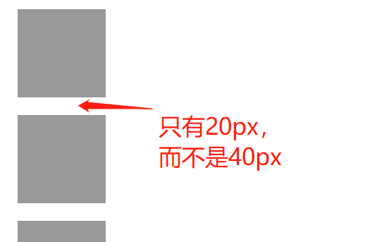
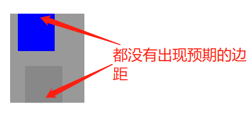

### 外边距合并 margin collapse


__处于同一个BFC中__的两个或多个__块级__盒子之间相邻的外边距会合并成一个边距，这种现象叫做__外边距合并__。

举个例子：

```html
<style>
body{
	margin:0;
}
.box{
    width: 100px;
    height: 100px;
    background: #999;
    margin: 20px;
}

</style>
   
<div class="box"></div>
<div class="box"></div>
<div class="box"></div>
```

每个盒子的外边距都是20px，那么理论上垂直方向上盒子之间的距离应该是40px，但实际情况却是两个盒子之间的距离只有20px：



外边距合并不光在兄弟元素之间，父子元素之间也可以发生外边距合并：

```html
<style>
body{
	margin:0;
}
.box{
    width: 100px;
    height: 100px;
    background: #999;
    margin: 20px;
}
.sub-box{
    width: 50px;
    height: 50px;
    background: blue;
    margin: 10px;
}
.sub-box1{
    width: 50px;
    height:50px;
    background: #888;
    margin:  20px;
}

</style>
   
<div class="box">
	<div class="sub-box"></div>
    <div class="sub-box1"></div>
</div>
```

以上代码预期效果是父子元素之间有10px和20px的间距，但实际效果如下：



来看下有哪些情况会发外生边距折叠，哪些情况不会发生外边距折叠：

* 创建了BFC的元素（浮动元素，绝对定位元素等）不会和其他元素发生边距折叠，包括子元素；
* 如果一个处于普通流中的块级盒子没有上边框，没有上内边距，第一个子元素也没有清除浮动，那么这个盒子的上外边距就会和第一个子元素的上外边距发生折叠；
* 如果处于普通流中的块级盒子的高度被设置为`auto`，并且没有下内边距，也没有下边框，该盒子的下外边距会和自己的最后一个处于普通流中的块级子元素的下外边距发生合并；

##### 外边距合并最终的边距大小：

* 如果合并的两个外边距都是正值，则合并结果是较大的那个外边距
* 如果合并的两个外边距一个是正值，一个是负值，则合并结果为两者相加
* 如果合并的两个外边距都是负值，则合并结果为绝对值较大的那个

##### 如何消除外边距合并

* 如果是兄弟地元素之间的外边距合并，消除方法是让其中的某个元素处于不同的BFC中，比如可以给其中一个元素外层再套一层容器，并设置容器的`overflow`为`hidden`，或者在两个元素之间加入其他内容，如下：

```html
<style>
body{
	margin:0;
}
.box{
    width: 100px;
    height: 100px;
    background: #999;
    margin: 20px;
}

</style>
   
<div class="box"></div>
<div style="overflow:hidden;width:0;height:0">.</div>
<div class="box"></div>
<div class="box"></div>
```

亲测有效果。

* 如果是父子元素之间发生外边距合并，可以给父元素加上`overflow:hidden`，这样子元素就处于和父元素不同的BFC中，其他能为子元素创建BFC的方法也可以达到同样的效果，比如浮动或者绝对定位。


参考：

https://stackoverflow.com/questions/19718634/how-to-disable-margin-collapsing

https://www.w3.org/TR/CSS22/box.html#collapsing-margins

